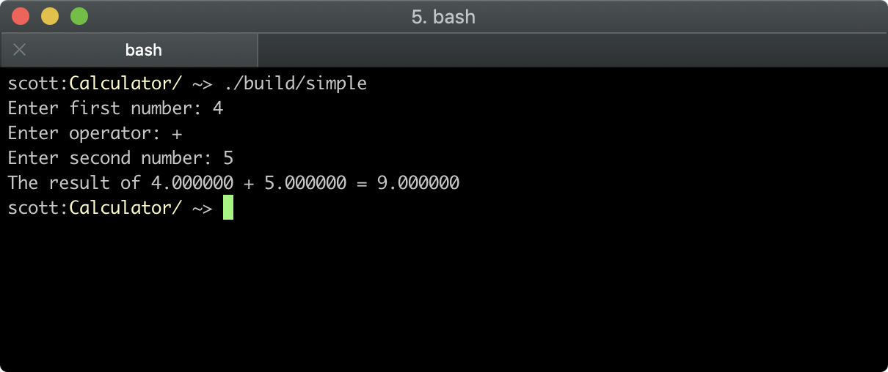
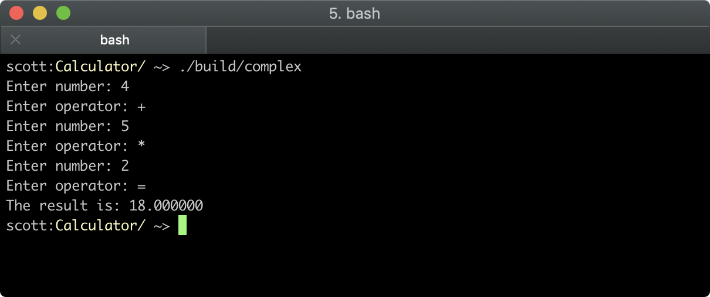

# C++ Calculator

## Setup

```bash
$ git clone https://github.com/neogeek/cpp_calculator.git
$ cd cpp_calculator
$ make
```

### Simple Calculator



```bash
$ ./build/simple
```

### Complex Calculator



```bash
$ ./build/complex
```

## Slides

[](slides/C++%20Calculator.pdf)
